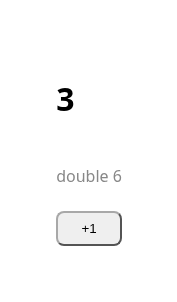

# Example: counter

The smallest vcsr app: one component written as a **file triplet** (V logic, an
HTML template, CSS), compiled by vcsr to plain V, then by V + clang to a
browser `core.wasm`. The page ships an empty `<div id="app">`; the wasm module
builds the UI and, on each click, patches only the two text nodes that change.



## Run it

```sh
vcsr wasm examples/counter/src     # gen + compile → examples/counter/wasm/core.wasm
vcsr serve examples/counter/wasm   # then open http://localhost:3000
```

`vcsr wasm` needs a [wasi-sdk](https://github.com/WebAssembly/wasi-sdk)
(`WASI_SDK`, default `/opt/wasi-sdk`). Without the CLI installed,
`wasm/build.sh` does the same from the repo source. To check it in Chrome and
refresh the screenshot: `make screenshots`.

## Files

| File | What it is |
|---|---|
| [src/counter.v](src/counter.v) | **logic**: the `Counter` struct — a `count` signal, the `inc` handler, the `doubled` computed |
| [src/counter.html](src/counter.html) | **template**: `{{ count }}`, `{{ doubled }}`, `@click="inc"` |
| [src/counter.css](src/counter.css) | **styles** (scoping them to the component is [roadmap item 3](../../docs/ROADMAP.md)) |
| [src/entry_d_wasm_browser.v](src/entry_d_wasm_browser.v) | the browser entry: `boot()` builds the view and mounts it into `#app` |
| [src/main_notd_wasm_browser.v](src/main_notd_wasm_browser.v) | the native entry (mock DOM), used by the tests |
| [src/counter_test.v](src/counter_test.v) | drives the generated `view()` natively (`make test`) |
| [wasm/index.html](wasm/index.html), [wasm/app.js](wasm/app.js) | the page and its entry, which imports `boot()` from the generated `vcsr_host.js` |
| [check.mjs](check.mjs) | the browser check: 0/0 → click → 1/2 → 3/6 |

The `_d_wasm_browser` / `_notd_wasm_browser` suffixes pick the file per target:
`vcsr wasm` compiles with `-d wasm_browser`.

## What vcsr generates

`vcsr gen examples/counter/src` (which `vcsr wasm` and `make test` run for you)
writes `src/counter.gen.v` — plain V, no compiler builtins:

```v
const __counter_tpl = runtime.Template{
	html:  '<main class="counter"><h1></h1><p class="muted">double <span></span></p><button>+1</button></main>'
	slots: [
		runtime.SlotDesc{ kind: .text, path: [0] },                 // <h1>     ← count
		runtime.SlotDesc{ kind: .text, path: [1, 0] },              // <span>   ← doubled
		runtime.SlotDesc{ kind: .event, path: [2], name: 'click' }, // <button> → inc
	]
}

fn counter_slot0_get(ctxp voidptr) string {
	mut c := unsafe { &Counter(ctxp) }
	return runtime.to_str(c.count.get())
}
// … one top-level helper per slot …

pub fn (mut c Counter) view() runtime.View {
	mut ins := __counter_tpl.instance()
	runtime.bind_text_ctx(mut ins, 0, voidptr(&c), counter_slot0_get)
	runtime.bind_text_ctx(mut ins, 1, voidptr(&c), counter_slot1_get)
	runtime.bind_event_ctx(mut ins, 2, voidptr(&c), counter_slot2_evt)
	return ins.view()
}
```

The HTML string is the static skeleton, embedded in the wasm data segment; the
host parses it once and clones it. The slot table says which node each binding
patches. Bindings are closure-free (a top-level fn plus a context pointer)
because capturing closures can't run on wasm.
