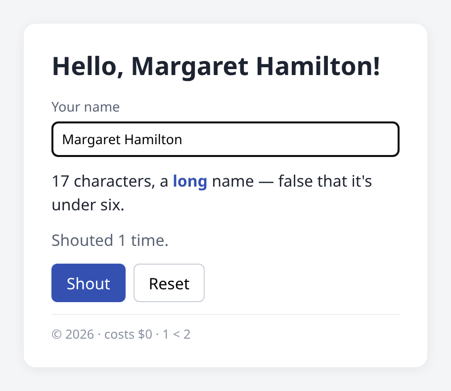

# Example: template basics

One component that exercises the template language: text mixed with
interpolations, interpolations beside elements, V expressions inside `{{ }}`
(comparisons, string interpolation, an `if` expression), a void `<input>` with
two-way binding, HTML entities, and a pretty-printed template.



## Run it

```sh
vcsr wasm examples/template-basics/src
vcsr serve examples/template-basics/wasm     # open http://localhost:3000
```

Type a name and the heading, the character count and the size label all update.
**Shout** upper-cases the name and counts the shouts. `make screenshots` re-runs
[check.mjs](check.mjs) in Chrome and refreshes the image above.

## What the template shows

[src/greeting.html](src/greeting.html), with the logic in
[src/greeting.v](src/greeting.v):

| Template | What vcsr does |
|---|---|
| `<h1>Hello, {{ name }}!</h1>` | text + interpolations in one element → **one** text slot, the concatenation |
| `{{ name.len }} characters, a <b>{{ size }}</b> name` | an interpolation beside element children → its own text node at an `<!---->` anchor |
| `{{ name.len < 6 }}` | `<` inside `{{ }}` is part of the expression, not a tag |
| `{{ 'Shouted ${shouts} time' + if shouts == 1 { '' } else { 's' } }}` | any V expression: the signal inside `${}` is read reactively |
| `<input @bind="name">` | a void element; `@bind` keeps the input and the `name` signal in sync |
| `&mdash;`, `&copy;`, `&lt;`, `$0` | entities decode (also inside text slots); a literal `$` is fine |
| indentation, line breaks | condensed like Vue does: the skeleton is the same as for a one-line template |

The whitespace rule: a whitespace-only text node is dropped when it is first or
last in its element, or sits between two tags and contains a line break;
otherwise whitespace runs collapse to one space. `<pre>` and `<textarea>` keep
theirs verbatim.

## Files

Same layout as [counter](../counter): the triplet (here without a `.css`; the
page styles live in [wasm/index.html](wasm/index.html) until component styles
land, [roadmap item 3](../../docs/ROADMAP.md)), a browser entry and a native
entry, the native test [src/greeting_test.v](src/greeting_test.v) (`make test`),
and the browser check [check.mjs](check.mjs) (`make examples`).
